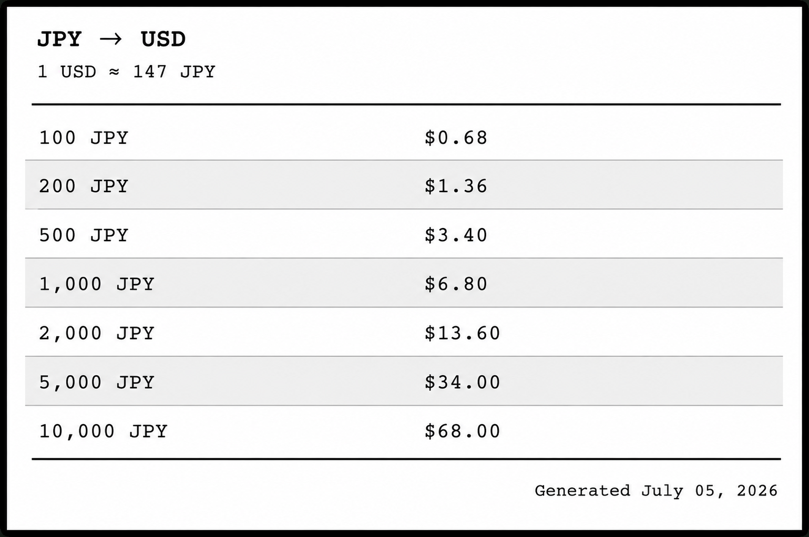

# Currency Cheat Sheet

> Wallet-sized PDF cheat cards for currency exchange rates —  
> pick a currency, get a printable card with all the common denominations converted to USD.



---

## Features

- **Live exchange rates** via [ExchangeRate-API](https://open.er-api.com) (free, no API key required)
- **1-2-5 denomination progression** — every card shows the full range of local notes/coins from the smallest up to 5 million local units
- **Locale-aware formatting** — currencies are grouped with the correct thousands separator for the country (e.g. `¥1,000` for Japan, `$1.000` for Chile)
- **Credit-card-sized PDF** — 53 mm × 85 mm, ready to print, cut, and slip into a wallet
- **Extensible** — add any currency by editing a single JSON config file

---

## How it works

```
config/currencies.json ───→ live exchange rate ───→ denomination list
                                                          │
                                                    convert each to USD
                                                          │
                                                    render HTML → PDF
```

1. **Load configuration** – reads the currency's symbol, locale, and known denominations from `config/currencies.json`.
2. **Fetch exchange rate** – calls `open.er-api.com` to get the current rate from the chosen currency to USD.
3. **Generate denominations** – fills in any missing 1-2-5 progression values (see [denominations.py](walletcard/denominations.py) for details).
4. **Convert** – multiplies every local denomination by the rate to produce a USD column.
5. **Render** – Jinja2 template + WeasyPrint produce a credit-card-sized PDF.

---

## Requirements

- Python ≥ 3.12
- WeasyPrint (depends on system libraries – see [WeasyPrint install docs](https://doc.courtbouillon.org/weasyprint/stable/first_steps.html))

---

## Installation & Usage

This project uses **[uv](https://docs.astral.sh/uv/)** for dependency management.

```bash
# Generate a wallet card for Japanese Yen
uv run python main.py JPY

# Generate a wallet card for Chilean Peso
uv run python main.py CLP
```

The output PDF is saved to `output/{CURRENCY}-wallet-card.pdf`.

### Example output

| Local amount | USD value                        |
|--------------|----------------------------------|
| ¥100         | $0.68                            |
| ¥200         | $1.36                            |
| ¥500         | $3.40                            |
| ¥1,000       | $6.80                            |
| …            | …                                |
| ¥5,000,000   | $34,000                          |

---

## Configuration

To add a new currency, edit [`config/currencies.json`](config/currencies.json) and add an entry:

```json
{
  "EUR": {
    "country": "European Union",
    "symbol": "€",
    "locale": "de-DE",
    "denominations": [5, 10, 20, 50, 100, 200, 500]
  }
}
```

| Field           | Description                                              |
|-----------------|----------------------------------------------------------|
| `country`       | Display name for the country / region                    |
| `symbol`        | Currency symbol (e.g. `¥`, `$`, `€`)                     |
| `locale`        | BCP 47 locale tag for number formatting (e.g. `ja-JP`)  |
| `denominations` | List of commonly-encountered note/coin values (ints)     |

The tool will automatically extend the list with a full 1-2-5 progression up to 5 million units, so you only need to list the key denominations.

---

## Project Structure

```
.
├── main.py                          # CLI entry point
├── pyproject.toml                   # Project metadata & dependencies
├── README.md
├── config/
│   └── currencies.json              # Currency definitions
├── design/
│   └── landscape-design.png         # Design mockup
├── static/
│   └── card.css                     # Print-friendly card styles
├── templates/
│   └── card.html                    # Jinja2 template for the PDF
├── walletcard/
│   ├── __init__.py
│   ├── config.py                    # Currency config loader
│   ├── converter.py                 # Wires config + rates + formatting
│   ├── denominations.py             # 1-2-5 progression generator
│   ├── formatting.py                # Locale-aware number formatting
│   ├── rates.py                     # Exchange rate API client
│   └── renderer.py                  # HTML → PDF via WeasyPrint
└── tests/
    ├── test_config.py
    ├── test_denominations.py
    ├── test_formatting.py
    └── test_rates.py
```

---

## Development

Run the test suite with:

```bash
uv run pytest
```

All tests live in the `tests/` directory and use standard `unittest.mock` / `pytest` patterns — no external API calls required.

---

## License

MIT